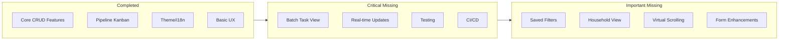

# Carbide CRM - Missing Functionality Implementation Plan

## Current State Summary

The application has a solid foundation with core features implemented:

- Authentication, routing, theme, i18n, state management
- Contacts, Organizations, Relationships, Cadences, Tasks, Activities, Dashboard
- Global search, accessibility features, animations

## Gap Analysis



---

## Phase 1: Critical Missing Features

### 1.1 Batch Task View (PRD Section 7.2)

The most important missing feature for efficient prospecting workflows.**Files to create:**

- `src/pages/BatchTasks.tsx` - Main batch task page
- `src/features/tasks/components/BatchTaskView.tsx` - Core batch view component
- `src/features/tasks/components/BatchTaskToolbar.tsx` - Filters, date range, visibility toggles
- `src/features/tasks/components/BulkActionBar.tsx` - Multi-select actions
- `src/features/tasks/hooks/useBatchTasks.ts` - Batch operations hook

**Key functionality:**

- Filter by task type, cadence, assigned user, date range
- Show/hide Overdue, Due Today, Upcoming, Triaged, Dismissed
- Individual task completion with inline notes
- Multi-select with bulk complete/triage/dismiss
- Overdue indicators (yellow/orange/red/stale badges)

### 1.2 Real-time Subscriptions (PRD Section 10)

Enable live updates across the application.**Files to create:**

- `src/hooks/useRealtimeSubscription.ts` - Supabase realtime hook
- Update `src/features/activities/hooks/useActivities.ts` - Add realtime
- Update `src/features/tasks/hooks/useTasks.ts` - Add realtime

### 1.3 NotFound Page

**File to create:** `src/pages/NotFound.tsx`

### 1.4 Testing Infrastructure (PRD Section 12)

Set up Vitest and Playwright for comprehensive testing.**Files to create:**

- `vitest.config.ts`
- `playwright.config.ts`
- `tests/setup.ts`
- `tests/unit/formatters.test.ts`
- `tests/unit/components/ContactCard.test.tsx`
- `tests/e2e/auth.spec.ts`
- `tests/e2e/contacts.spec.ts`

**Package additions:**

```json
"vitest": "^2.0.0",
"@testing-library/react": "^16.0.0",
"@testing-library/jest-dom": "^6.5.0",
"@playwright/test": "^1.48.0",
"jsdom": "^25.0.0"
```


### 1.5 CI/CD Pipeline (PRD Section 15)

**Files to create:**

- `.github/workflows/ci.yml` - Lint, type-check, test, build
- `.github/workflows/preview.yml` - Preview deployments
- `vercel.json` - Deployment config with CSP headers

---

## Phase 2: Important Missing Features

### 2.1 Saved Filter Views (PRD Section 9.2)

Allow users to save and quickly access filter combinations.**Files to create/update:**

- `src/hooks/useFilterParams.ts` - Enhanced with Zod validation
- `src/stores/uiStore.ts` - Add savedFilters persistence
- `src/components/filters/SavedFiltersDropdown.tsx`
- `src/components/filters/SaveFilterDialog.tsx`

### 2.2 Household View (PRD Section 3.1)

Combined timeline for primary relationship groups.**Files to create:**

- `src/features/contacts/components/HouseholdTimeline.tsx`
- `src/features/contacts/hooks/useHouseholdActivities.ts`
- Update `src/features/contacts/components/ContactDetail.tsx` - Add toggle

### 2.3 Activity Timeline Filtering (PRD Section 7.1)

**Update:** `src/features/activities/components/ActivityFeed.tsx`

- Add filter tabs: All, Emails, Calls, Notes, Meetings, System

### 2.4 Relationship Form (PRD Section 4)

**Files to create:**

- `src/features/relationships/components/RelationshipForm.tsx`
- `src/lib/validators/relationship.ts` - Zod schemas for all relationship types
- `src/features/relationships/components/CreateRelationshipDialog.tsx`

### 2.5 Virtual Scrolling for Large Lists

**Update files:**

- `src/features/contacts/components/ContactList.tsx`
- `src/features/tasks/components/TaskList.tsx`
- `src/components/data-display/VirtualizedList.tsx`

---

## Phase 3: Form and UX Enhancements

### 3.1 Form Improvements

**Files to create:**

- `src/hooks/useAutoSave.ts` - Auto-save with debounce
- `src/hooks/useUnsavedChangesWarning.ts` - useBeforeUnload + React Router blocker
- Update all form components to use these hooks

### 3.2 Keyboard Shortcut Help

**File to create:** `src/components/ui/keyboard-shortcut-help.tsx`

- Trigger with `?` key
- List all available shortcuts

### 3.3 Enhanced Skeletons

**Files to create:**

- `src/components/ui/skeletons.tsx` - ContactDetailSkeleton, TableSkeleton, etc.

### 3.4 User Settings Page

**Files to create:**

- `src/pages/Settings.tsx` - Enhance existing with tabs
- `src/features/settings/components/ProfileSettings.tsx`
- `src/features/settings/components/PreferencesSettings.tsx`
- `src/features/settings/components/NotificationSettings.tsx`

---

## Phase 4: Polish and Production Readiness

### 4.1 Enhanced Error Handling

**Files to create:**

- `src/components/error/ErrorBoundary.tsx` - Route-level error boundary
- `src/components/error/ErrorFallback.tsx` - User-friendly error display

### 4.2 Environment Validation

**File to create:** `src/lib/env.ts` - Zod schema for environment variables

### 4.3 Additional Translations

**Files to create:**

- `src/lib/i18n/locales/es.json` - Spanish translations
- Update `src/lib/i18n/index.ts` - Register new locales

### 4.4 Enhanced Formatters

**Update:** `src/lib/formatters.ts`

- Add `formatCurrency`, `formatRelativeTime`, `formatPhoneNumber`

---

## Implementation Priority

| Priority | Feature | Est. Effort ||----------|---------|-------------|| P0 | Batch Task View | 2-3 days || P0 | NotFound Page | 30 min || P0 | Testing Infrastructure | 1-2 days || P1 | Real-time Subscriptions | 1 day || P1 | CI/CD Pipeline | 1 day || P1 | Saved Filter Views | 1 day || P2 | Household View | 1 day || P2 | Activity Filtering | 0.5 day || P2 | Relationship Form | 1 day || P2 | Virtual Scrolling | 0.5 day || P3 | Form Enhancements | 1 day || P3 | Keyboard Shortcut Help | 0.5 day || P3 | Settings Page Enhancement | 1 day || P3 | Error Handling | 0.5 day || P3 | Polish Items | 1 day |**Total Estimated Effort: 12-15 days**---

## Key Files Reference

- Router: [`src/router.tsx`](src/router.tsx)
- Task Service: [`src/features/tasks/services/taskService.ts`](src/features/tasks/services/taskService.ts)